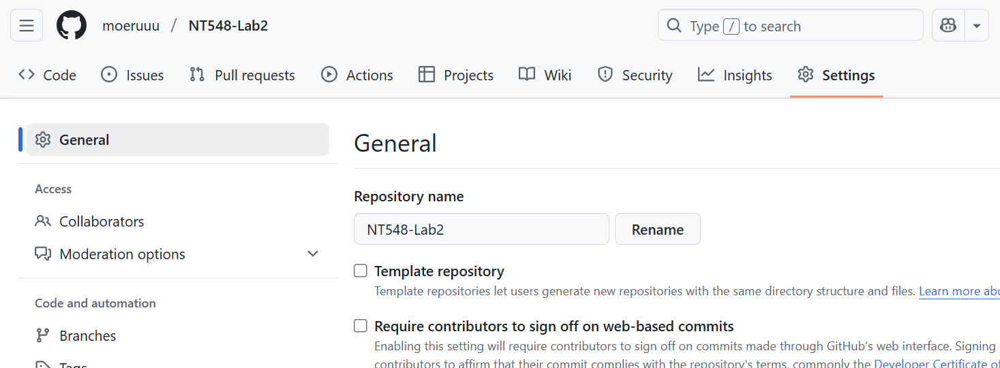
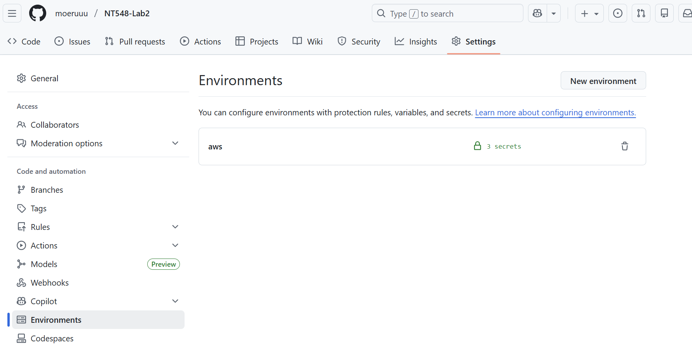
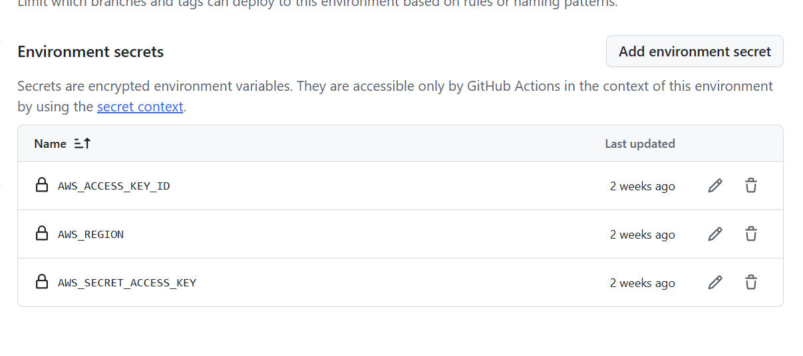
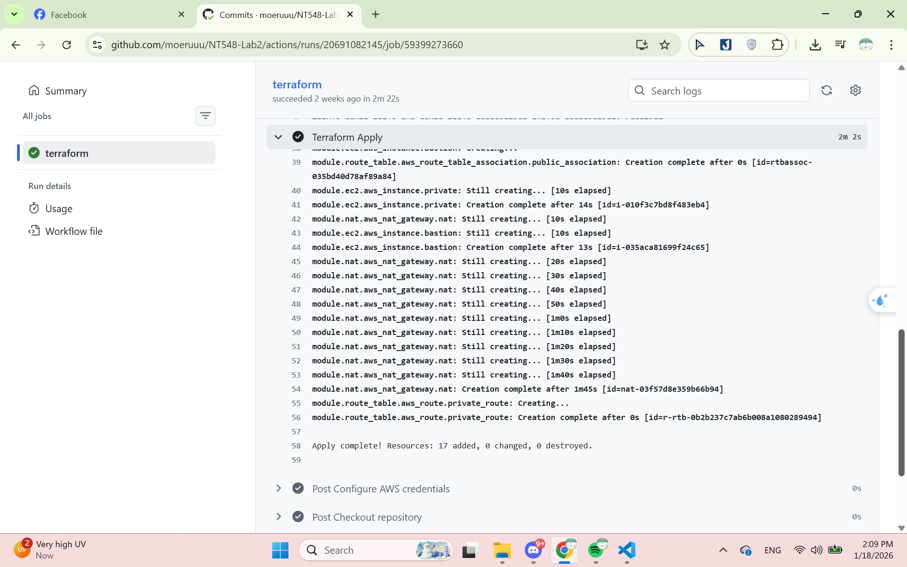

# NT548.Q11 - Lab 2
## Group 09
|    MSSV   |      Họ và tên     | Công việc      |
|-----------|--------------------|-------------   |
|  23520797 | Lê Trung Kiên      | CloudFormation |
|  23521588 | Trần Thị Thùy Tiên | CloudFormation |
|  23521471 | Trần Thuận Thến    | Terraform      |
|  23521564 | Trần Lê Uyên Thy   | Terraform      |

## Báo cáo
### CICD
1. **Cài đặt GitHub Secrets**
- Vào trang setting trong repo


- Vào ``Environments`` và tạo environments mới, ở đây đặt là "aws"


- Tạo environment secrets (ở đây là `AWS_ACCESS_KEY_ID`, `AWS_REGION`, `AWS_SECRET_ACCESS_KEY`)


2. **Cách thực hiện**
- Clone repo
```bash
git clone https://github.com/moeruuu/NT548-Lab2
cd NT548-LAB2
```

- Tạo một branch mới
```bash
git checkout -b test
```

- Thay đổi code và commit code mới
```bash
git add .
git commit -m "feat: new code"
git push origin test
```

- Sau khi code được push thành công, tạo pull request và chờ được merge

- Có thể theo dõi quá trình chạy cicd

